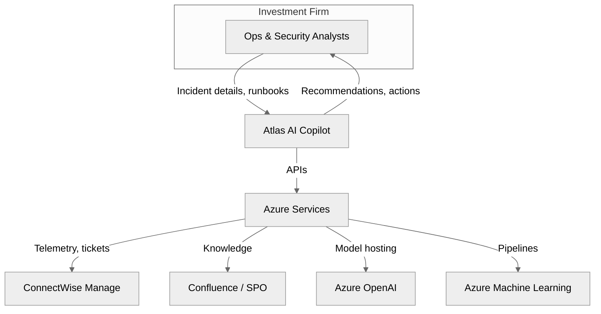
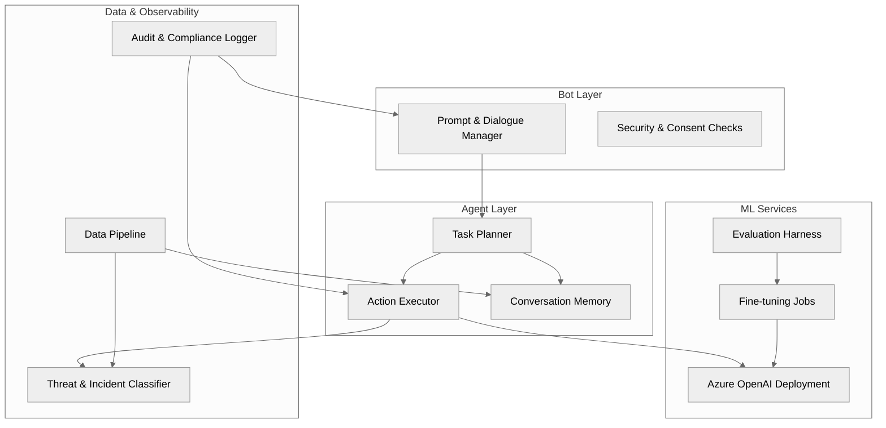

# Atlas AI POC Architecture

The proof-of-concept focuses on an Azure-first AI/ML pipeline for investment-sector infrastructure management and cybersecurity automation. The diagrams below follow the C4 model (Context, Container, Component) using Mermaid notation.

## Context (C4 Level 1)


## Containers (C4 Level 2)
```mermaid
%%{init: {'theme': 'neutral','flowchart': {'curve': 'basis'}}}%%
flowchart LR
  subgraph Web[User Experience]
    WebClient[Teams/Portal Frontend]
    BotService[Azure Bot Service]
  end

  subgraph AI[AI & ML]
    Orchestrator[Agent Orchestrator]
    RAG[Retrieval & Memory Store]
    ThreatModel[Threat Classifier Model]
    AMLPipelines[Azure ML Pipelines]
  end

  subgraph Data[Data Plane]
    EventHub[Event Hub / Log Ingestion]
    Storage[Blob Storage]
    VectorDB[Vector Store (Cognitive Search)]
  end

  subgraph Integration[Enterprise Systems]
    ConnectWiseAPI[ConnectWise Manage API]
    ConfluenceAPI[Confluence/SPO API]
    Identity[Azure AD / Entra]
  end

  Users((Analysts)) --> WebClient
  WebClient --> BotService
  BotService --> Orchestrator
  Orchestrator --> RAG
  Orchestrator --> ThreatModel
  Orchestrator --> AMLPipelines
  RAG --> VectorDB
  AMLPipelines --> Storage
  EventHub --> Storage
  Orchestrator --> ConnectWiseAPI
  Orchestrator --> ConfluenceAPI
  Orchestrator --> Identity
```

## Components (C4 Level 3)


## Operational Controls
- **Security & Compliance**: Azure AD for identity, Key Vault for secrets, encrypted storage, audit trails for all agent actions.
- **Deployment**: CI/CD with gated environments, Infrastructure as Code templates for reproducibility.
- **Observability**: Centralized logging/metrics, run-level tracing for AI calls, and drift detection for infrastructure policy compliance.
